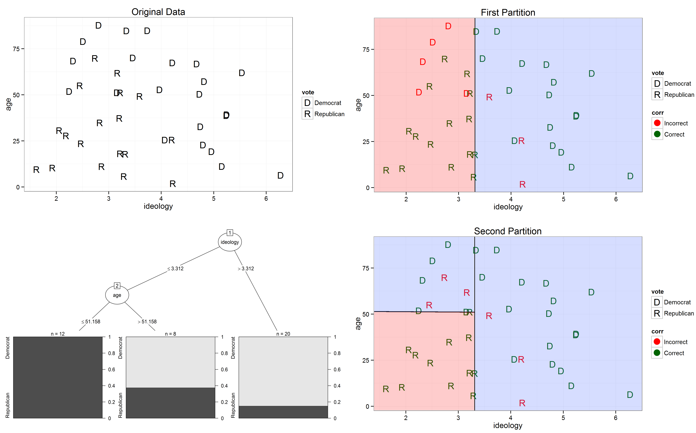
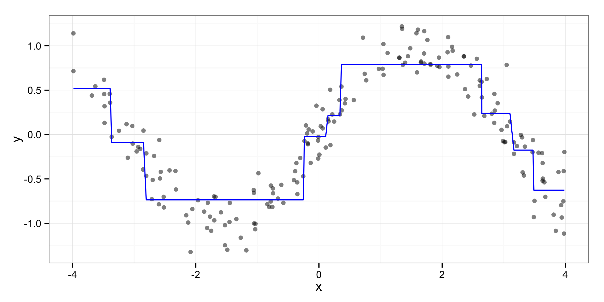
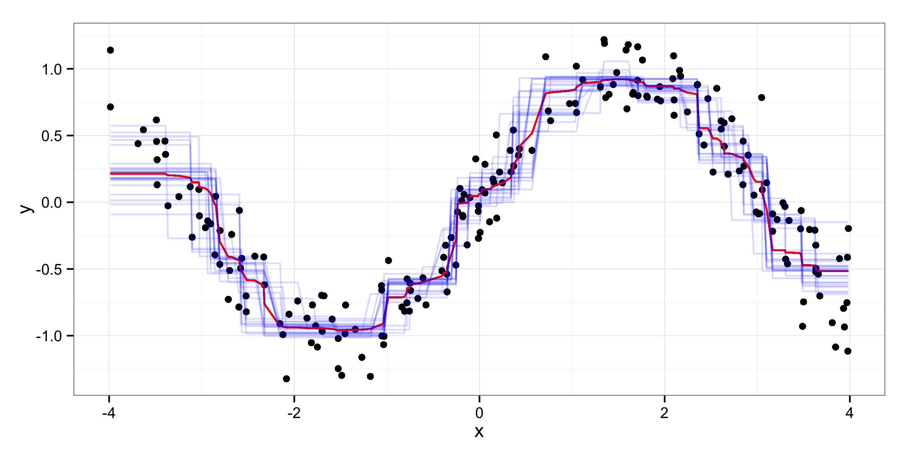

% Data Mining as Exploratory Data Analysis
% Zachary Jones

# The Problem(s)

 - presumptions
    - social systems are complex (i.e., not linear, additive, or static)
    - causal identification is difficult/impossible with many data sources
	- theory not generally predictively reliable (may be exceptions to this)
- conclusions
    - confidence in assumptions (assumed joint distribution, causal structure, etc.) is low
    - many theoretical guarantees do not apply
    - analysis is exploratory/descriptive and/or predictive
	- ability to discover unexpected patterns is desirable (i.e., data driven discovery)

# Data Mining

Not a bad thing.

 - estimation of $f(X)$ under minimal assumptions
 - minimize *expected* prediction error
 - adapt to data (within a representation class)

however, $\hat{f}(X)$ is often not (*directly*) interpretable!

# Supervised Learning (I)

if $(X, Y) \sim \mathbb{P}_{\mathcal{X} \times \mathcal{Y}}$ estimate $f : X \to Y$ using $(\mathbf{x}, \mathbf{y})$

rather than specifying in detail what $f$ looks like assume $f$ is approximated by some class of functions $\mathcal{F}$ and find the member of that class closest to $f$ (which may not be in $\mathcal{F}$) according to the risk function

$\mathcal{F}$ and find the closest $f^* \in \mathcal{F}$ to $f$ (not necessarily in $\mathcal{F}$) as measured by a risk function, which is the expected cost or loss over $\mathbb{P}_{\mathcal{X} \times \mathcal{Y}}$

$$R(f) = \mathbb{E}_{\mathbb{P}} \left[ L(Y, f(X)) \right]$$

# Supervised Learning (II)

 - Consistency for $f$ is hard! (but some algorithms are provably consistent)
 - In general learning theory is (seems) quite difficult
 - Estimation/learning is often heuristic (i.e., not globally optimal) because the problem is higher dimensional (goodbye intuitions!) and not (necessarily) well-behaved (good behavior comes at the cost of assumptions)
 - Some examples...

# Decision Trees (I)

Idea: approximate $f$ by recursively splitting $\mathbf{y}$ into bins until $\mathbf{y}$ is sufficiently homogenous in said bins: predict by using a constant function of $\mathbf{y}$ in each bin

The result is a regression/classification where on i

 - Pros: interpretability, fitting/evaluation speed
 - Cons: overadaptation, variance (sharp boundaries), greedy (some work on global optimality though, see [evtree](https://cran.r-project.org/web/packages/evtree/index.html))

# Decision Trees (II)

# Decision Trees (III)

# Ensembles of Decision Trees

**aggregation** (bagging)
 - sampling from $\mathbf{x}$, training on the psuedosamples, and aggregating the predictions reduces the variance of $\hat{f}$ by decreasing the correlation between the predictions made by the trees grown on different psuedosamples

**meta-learning** (boosting)
 - gradient descent in function space $\equiv$ forward stagewise additive modelling (e.g., Buhlmann and Hothorn 2007, ESL 10)

**randomization** (random forests)
- a further decrease in variance beyond aggregation by randomly sampling the available features at each split

# Random Forests (I)

Nice for exploratory data analysis for:

 - computational reasons (in progress: [edarf](http://github.com/zmjones/edarf))
 - usability for many tasks (i.e., regression, classification, survival, and multivariate combinations thereof)
 - some (studied) methods for interpretation (e.g., Strobl et. al. 2007, 2008, Louppe 2014)
 - low number of tuning/hyperparameters (features available at each node, depth)
 - good empirical performance
 - some theory (Brieman 2001, Biau et. al. 2008, Biau 2012, Wager et. al. 2014, etc.)

# Random Forests (II)

# Supervised Learning for Description/EDA

Since most machine learning methods are designed for prediction their generalization error (i.e., risk) is low (because they are attempting to make the optimal bias/variance tradeoff, see, e.g., Fariss and Jones (2015) or any machine learning textbook)

Predicting a complex phenomena reliably gives us some basis on which to interpret $\hat{f}$ (though obviously this is not a causal inference)

But what did $\hat{f}$ learn about $f$ by using $X$?

# Interpreting Black Box Functions (I)
## The Marginal Distribution (A)

$$X = X_S \cup X_C$$

$S$ we care about and $C$ we do not (at the moment)

The marginal distribution summarizes how $\hat{f}$ depends on $X_s$.

$$\hat{f}_S(X_S) = \mathbb{E}_{X_C} \hat{f}(X_S, X_C)$$

The expectation, variance, multiple moments, or the full marginal distribution can then be used.

# Interpreting Black Box Functions (I)
## The Marginal Distribution (B)

Ideas from Friedman (2001), ESL, and Goldstein et. al. (2015)

We have a function which we can evaluate, so functions of the learned joint distribution are easy!

$$\hat{f}_S(\mathbf{x}_S) = \hat{\mathbb{E}}_{X_C}(\hat{f}(\mathbf{x})) = \frac{1}{N} \sum_{i=1}^N \hat{f}(\mathbf{x}_S, \mathbf{x}_C^{(i)})$$

$$\hat{f}_S(\mathbf{x}_S^{(i)}) = \hat{\mathbb{E}}_{X_C}^{(i)}(\mathbf{x}^{(i)}) = \hat{f}(\mathbf{x}_s, \mathbf{x}_c^{(i)})$$

# Interpreting Black Box Functions (II)
## Derivatives

If $\hat{f}$ is additive in $(X_S, X_C)$ then:

$$\frac{\partial \hat{f}}{\partial X_S} = g(X_S)$$

If not then:

$$\frac{\partial \hat{f}}{\partial X_S} = g(X_S) h(X_C)$$

Numerical differentiation can be applied if $\hat{f}$ continuous and in estimating the derivative of the individual conditional expectation function we can get an idea of whether or not $\hat{f}$ is additive in $(X_S, X_C)$.

# Interpretation of Black Box Functions (III)
## Feature/Variable Importance

How important is $X_S$ in achieving $R(\hat{f})$?

If the theoretical joint distribution $\mathbb{P}(Y, X_S, X_C) = \mathbb{P}(Y, X_C) \mathbb{P}(X_S)$ then permuting $X_S$ won't increase the prediction error.

$$I_{X_S} = \frac{1}{N} \sum_{i = 1}^N C(\mathbf{x}_{S \pi}^{(i)}, \mathbf{x}_C^{(i)})$$

$$I_{X^{(i)}_S} = C(\mathbf{x}_{S \pi}^{(i)}, \mathbf{x}_C^{(i)})$$

By using the individual $(i)$ importance rather than the expectation combined with a density estimator, we can estimate the density of the cost function under $\mathbf{x}_{S \pi}$ for different points in the distribution of $Y$ (as estimated from $\mathbf{y}$).

# Future Work on Interpretation

All of this will be in MLR!

 - extrapolation detection
 - more variance estimation
 - functional ANOVA decomposition (e.g., best additive decomposition of $\hat{f}$, c.f., Giles Hooker's work)
 - local feature importance and density estimation

# Future Work on Learning/Estimation

 - dependent data! (coming to MLR)
 - conditional independence not generally different (i.e., include structure as features)
 - estimation of latent variables
 - resampling methods
 - preprocessing/filtering

# Relevant Papers/Writing on Interpretation

 - ESL (10.13.2)
 - Freidman (2001)
 - Roosen (1995)
 - Hooker (2004, 2007)
 - Goldstein et. al. (2015)

# Implementations

 - mlr: **M**achine **L**earning with **R** (contributor, first via GSoC)
 - edarf: **E**xploratory **D**ata **A**nalysis using **R**andom **F**orests (my package)
 - ICEbox: **I**ndividual **C**onditional **E**xpectation plot toolbox (Goldstein et. al. 2015)

On to the demonstration! (`eda.R`)

On my [website](http://zmjones.com/) under "[Talks](http://zmjones.com/cv#Talks)."
